# АРПО. Лабораторная работа №1 — Автоматизация сборки 2D-игры через командную строку (CLI)

**Студент:** [ФИО полностью], группа [НОМЕР ГРУППЫ]
**Репозиторий:** https://github.com/Tiasssd/2d_platformer (рабочая ветка `LR1`)
**Движок:** Unity 6000.3.10f1, шаблон проекта — 2D Platformer Microgame
**Путь к проекту:** `C:\Users\shekh\OneDrive\Desktop\АРПО\Лаб 1\2d_platformer`

## Цель работы

Освоить автоматическую сборку проекта Unity под платформу WebGL из командной строки, без графического интерфейса редактора, и оформить результат в Git с прохождением процедуры peer review.

## Задание

1. Создать проект на базе шаблона 2D Platformer Microgame.
2. Написать скрипт автоматической сборки `BuildManager.cs` в папке `Assets/Editor/`.
3. Отключить сжатие WebGL, чтобы сборку можно было запускать локально.
4. Собрать проект из терминала в режиме `-batchmode -nographics`.
5. Проанализировать лог сборки и проверить работоспособность игры через Live Server.
6. Зафиксировать проект в Git, создать ветку `LR1`, оформить pull request и пройти ревью.

## Шаг 1. Инициализация проекта

Проект создан в Unity Hub на базе официального шаблона **2D Platformer Microgame**, редактор — Unity **6000.3.10f1**. Основная сцена игры лежит в папке `Assets/Scenes/` и отмечена галочкой в списке сцен сборки.

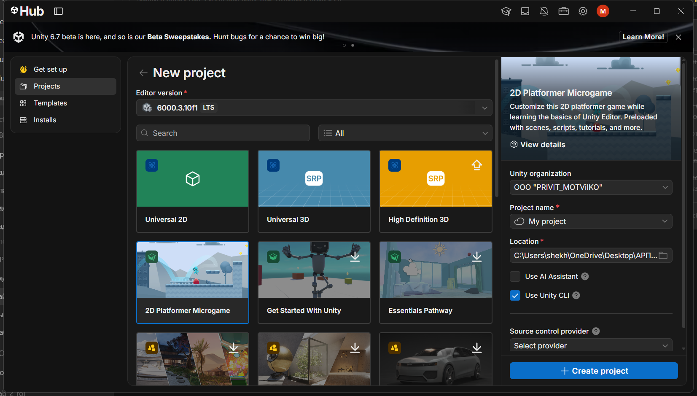

Структура исходного проекта изучена: сцены, игровые объекты, скрипты управления персонажем и логика уровней. Движение персонажа, камера и подсчёт очков реализованы готовыми компонентами шаблона, поэтому для лабораторной работы собственная игровая логика не требуется — задача состоит в автоматизации сборки.

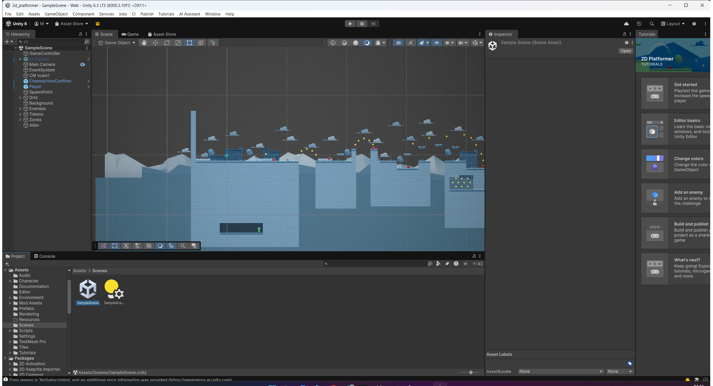

В список сцен сборки добавлена основная сцена игры. В Unity 6 это окно доступно через `File → Build Profiles`, вкладка со списком сцен (`Scene List`); в терминах методички оно называется `Build Settings`. Именно этот список читает скрипт сборки через API `EditorBuildSettings.scenes`.

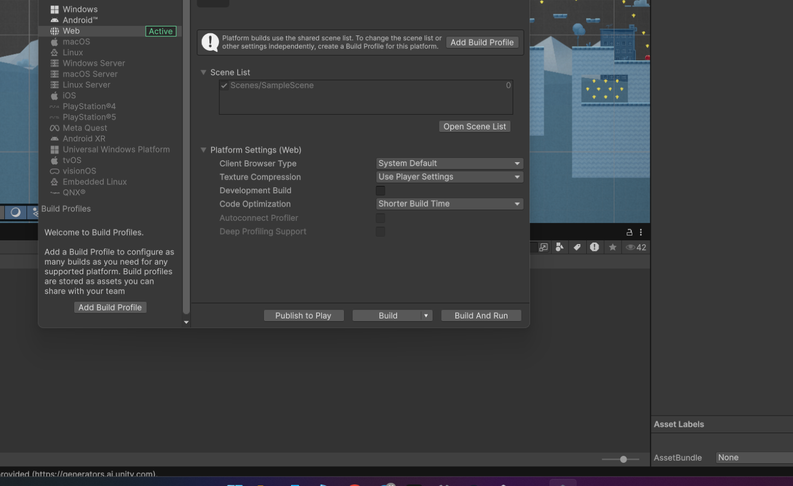

## Шаг 2. Скрипт автоматической сборки

В проекте создана служебная папка `Assets/Editor` (строго с большой буквы). Код из этой папки компилируется в отдельную сборку редактора и не попадает в финальную игру, поэтому класс `BuildManager` не увеличивает размер билда. В папке размещён файл `BuildManager.cs`.

Листинг 1 — скрипт автоматической сборки `Assets/Editor/BuildManager.cs`.

```csharp
using System;
using UnityEditor;
using UnityEditor.Build.Reporting;
using UnityEngine;

/// <summary>
/// Автоматический сборщик проекта.
/// Скрипт лежит в папке Assets/Editor — эта папка служебная, её код
/// выполняется только внутри редактора и не попадает в финальную сборку игры.
/// </summary>
public static class BuildManager
{
    // Путь для сохранения WebGL-версии игры
    private static readonly string WebGLBuildPath = "Builds/WebGL";

    /// <summary>
    /// Автоматический метод сборки игры под платформу WebGL.
    /// Вызывается из командной строки флагом -executeMethod BuildManager.BuildWebGL
    /// либо вручную из меню Unity: CI/CD → Build WebGL.
    /// </summary>
    [MenuItem("CI/CD/Build WebGL")]
    public static void BuildWebGL()
    {
        Debug.Log("[CI/CD] Запущен автоматический процесс сборки WebGL...");

        // 1. Получаем список сцен, включенных в настройки проекта (Build Settings)
        string[] levels = GetScenes();
        if (levels.Length == 0)
        {
            Debug.LogError("[CI/CD] Ошибка: В Настройках Сборки (Build Settings) не найдено ни одной активной сцены!");
            ExitWithCode(1);
            return;
        }

        // 2. Конфигурируем параметры сборки
        BuildPlayerOptions buildPlayerOptions = new BuildPlayerOptions
        {
            scenes = levels,
            locationPathName = WebGLBuildPath,
            target = BuildTarget.WebGL,
            options = BuildOptions.None // Для отладочной сборки можно использовать BuildOptions.Development
        };

        // 3. Запускаем компиляцию
        BuildReport report = BuildPipeline.BuildPlayer(buildPlayerOptions);
        BuildSummary summary = report.summary;

        // 4. Анализируем результаты
        if (summary.result == BuildResult.Succeeded)
        {
            Debug.Log($"[CI/CD] УСПЕХ! WebGL билд успешно создан.");
            Debug.Log($"[CI/CD] Время сборки: {summary.totalTime.TotalSeconds:F2} сек. Размер: {summary.totalSize} байт.");
            ExitWithCode(0);
        }
        else
        {
            Debug.LogError($"[CI/CD] ОШИБКА СБОРКИ! Количество ошибок: {summary.totalErrors}");
            ExitWithCode(1);
        }
    }

    /// <summary>
    /// Вспомогательный метод для сбора всех активных сцен из проекта
    /// </summary>
    private static string[] GetScenes()
    {
        var editorScenes = EditorBuildSettings.scenes;

        // Считаем только те сцены, у которых стоит галочка "активна"
        int activeCount = 0;
        foreach (var scene in editorScenes)
        {
            if (scene.enabled) activeCount++;
        }
        string[] scenePaths = new string[activeCount];
        int index = 0;

        foreach (var scene in editorScenes)
        {
            if (scene.enabled)
            {
                scenePaths[index] = scene.path;
                index++;
            }
        }
        return scenePaths;
    }

    /// <summary>
    /// Корректное завершение процесса Unity в зависимости от режима запуска
    /// </summary>
    private static void ExitWithCode(int code)
    {
        // Если Unity запущена в batchmode (из консоли) — принудительно закрываем редактор с кодом возврата
        if (Environment.CommandLine.Contains("-batchmode"))
        {
            EditorApplication.Exit(code);
        }
    }
}
```

Метод `BuildWebGL` объявлен как `public static`, потому что Unity вызывает его по имени через рефлексию, не создавая экземпляр класса. Атрибут `[MenuItem]` добавлен для того, чтобы тот же метод можно было запускать из меню редактора — в верхней панели Unity появляется пункт `CI/CD → Build WebGL`.

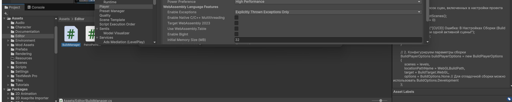

## Шаг 3. Отключение сжатия WebGL

В настройках `Edit → Project Settings → Player`, на вкладке Web (WebGL), в разделе `Publishing Settings` параметр `Compression Format` переключён с `Gzip` на `Disabled`. Это обязательный шаг для локального запуска: браузеры не распаковывают Gzip-сборку при открытии через локальный веб-сервер, и игра зависает на полосе загрузки.

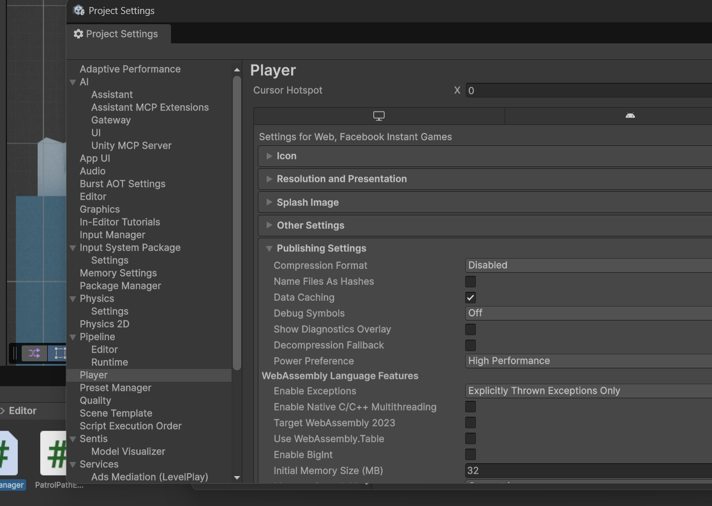

В файле `ProjectSettings/ProjectSettings.asset` настройке соответствует параметр `webGLCompressionFormat: 2` (значение 2 = Disabled). После сохранения настроек редактор Unity был полностью закрыт: один и тот же проект нельзя держать открытым в двух экземплярах, консольная сборка открывает проект монопольно.

## Шаг 4. Проверка скрипта через интерфейс Unity

Скрипт скомпилирован без ошибок, в меню редактора появился пользовательский пункт `CI/CD`. Проверка через графический интерфейс позволяет убедиться в отсутствии синтаксических ошибок до запуска консольной сборки, где ошибка видна только в текстовом логе.

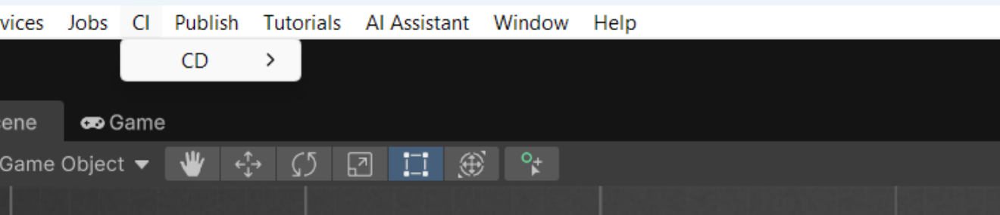

## Шаг 5. Локальная сборка через терминал

Редактор Unity закрыт, консоль открыта в корневой папке проекта. Команда запуска автоматической сборки для Windows:

```
"C:\Program Files\Unity\Hub\Editor\6000.3.10f1\Editor\Unity.exe" -batchmode -nographics -executeMethod BuildManager.BuildWebGL -quit -logFile build_webgl.log
```

В проекте та же команда завёрнута в скрипты-обёртки, чтобы сборка запускалась одной командой без ручного набора аргументов: `build_webgl.bat` (cmd), `build_webgl.ps1` (PowerShell), `build_webgl.sh` (Linux/macOS). Обёртки проверяют наличие `Unity.exe`, запускают сборку и возвращают её код возврата.

Флаг `-batchmode` отключает графический интерфейс редактора и диалоговые окна, `-nographics` отключает инициализацию графического движка и видеокарты, `-executeMethod` указывает метод, который нужно выполнить сразу после открытия проекта, `-quit` закрывает Unity после завершения метода, `-logFile` перенаправляет весь вывод консоли в текстовый файл.

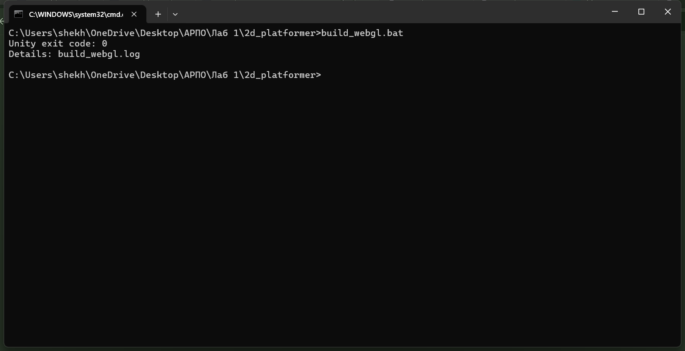

Сборка идёт в фоне, консоль не выводит прогресс и «замирает» на одну–три минуты: весь вывод пишется в лог-файл.

## Шаг 6. Анализ результатов и логов сборки

В корне проекта появился файл `build_webgl.log`, в конце которого находится строка `[CI/CD] УСПЕХ! WebGL билд успешно создан.` В папку `Builds/WebGL/` выгружены скомпилированные веб-файлы игры:

| Файл / папка | Назначение |
|---|---|
| `index.html` | HTML-страница-загрузчик, создаёт экземпляр Unity |
| `Build/WebGL.loader.js` | загрузчик сборки |
| `Build/WebGL.framework.js` | сгенерированный JavaScript-фреймворк |
| `Build/WebGL.wasm` | скомпилированный WebAssembly-код игры |
| `Build/WebGL.data` | упакованные ресурсы и сцены |
| `TemplateData/` | стили, иконки и логотипы шаблона страницы |

Имена файлов сборки совпадают с именем последней папки в `locationPathName`: путь `Builds/WebGL` даёт файлы `WebGL.*` (при сборке через графическое окно Build Profiles в папку `Builds` файлы получили бы имена `Builds.*`).

Так как сжатие отключено (шаг 3), файлы выгружаются без расширений `.gz`/`.br`, и `index.html` ссылается на них напрямую: `Build/WebGL.wasm`, `Build/WebGL.data`, `Build/WebGL.framework.js`. Папка `StreamingAssets` появляется в сборке только при наличии файлов в `Assets/StreamingAssets` — в этом проекте таких файлов нет.

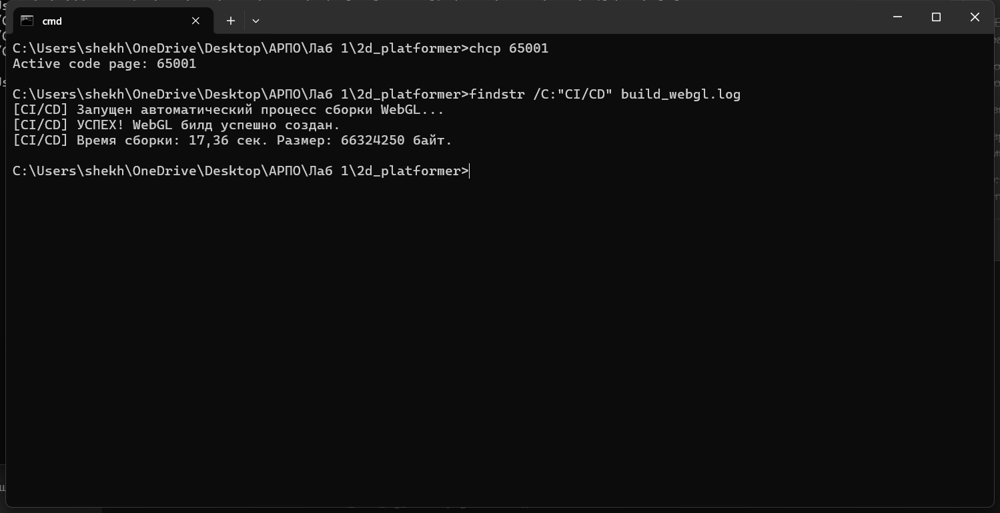

Помимо сообщения об успехе, в лог пишется время сборки и размер готового билда, которые вычисляются из структуры `BuildSummary`:

```
[CI/CD] УСПЕХ! WebGL билд успешно создан.
[CI/CD] Время сборки: 22,32 сек. Размер: 66324251 байт.
```

Код возврата процесса равен нулю (`Unity exit code: 0`) — именно по нему система непрерывной интеграции понимает, что сборка прошла успешно.

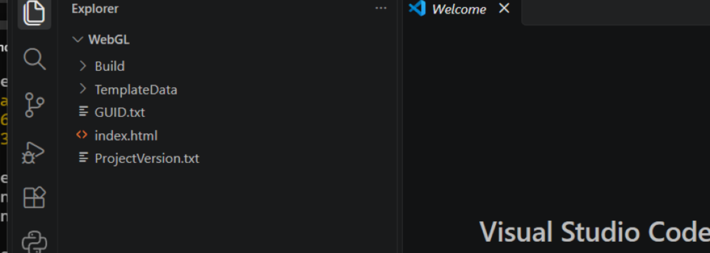

## Шаг 7. Проверка работоспособности (локальный запуск)

Обычный двойной клик по `index.html` не работает: браузер блокирует загрузку файлов сборки по политике CORS. Папка `Builds/WebGL/` открыта в VS Code, запущено расширение Live Server, страница открыта по адресу `http://127.0.0.1:5500`.

Полоса загрузки Unity доходит до конца, отображается главный экран микроигры, персонаж реагирует на управление — сборка работоспособна.

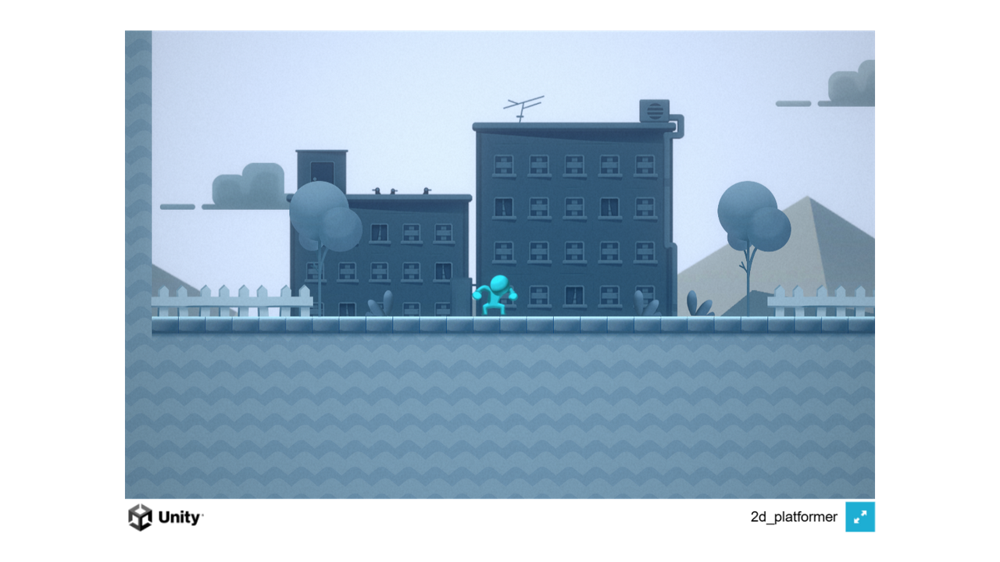

Дополнительно сборка проверена любым статическим HTTP-сервером (`python -m http.server`): полоса загрузки доходит до 100 %, главный экран игры отрисовывается, ошибок загрузки в консоли браузера нет.

## Шаг 8. Настройка Git и публикация

В корне проекта создан файл `.gitignore`, исключающий из репозитория служебные и генерируемые файлы Unity: `Library/`, `Temp/`, `Logs/`, `Builds/`, файлы решений IDE и лог сборки.

Листинг 2 — содержимое файла `.gitignore`.

```
[L|l]ibrary/
[Tt]emp/
[Oo]bj/
[L|l]ogs/
[U|u]sers/
[B|b]uild/
[B|b]uilds/
[Uu]ser[Ss]ettings/
[P|p]roject[S|s]ettings/ProjectVersion.txt
*.cs.md
*.csproj
*.unityproj
*.sln
*.suo
*.user
*.userprefs
*.pidb
*.booproj
*.svd
*.pdb
*.opendb
*.VC.db
build_webgl.log
```

Базовое состояние проекта зафиксировано в главной ветке `main` без файлов лабораторной работы: скрипт `BuildManager.cs`, скрипты-обёртки сборки и отчёт `README.md` на время первого коммита были перемещены за пределы проекта, а затем возвращены. Так в `main` попал чистый шаблон игры, а весь код лабораторной работы сосредоточен в отдельной ветке.

```
git init
git branch -M main
git add .
git commit -m "chore: initializing a 2D Platformer Microgame project"
git remote add origin https://github.com/Tiasssd/2d_platformer.git
git push -u origin main
git checkout -b LR1
git add Assets/Editor/BuildManager.cs build_webgl.bat build_webgl.ps1 build_webgl.sh
git commit -m "feat: added BuildManager script for build automation"
git push origin LR1
```

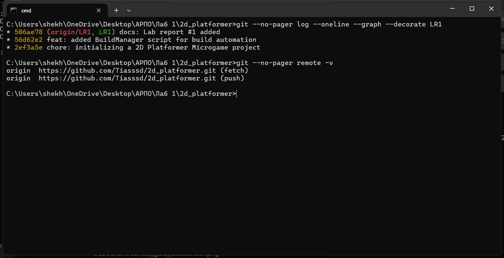

## Шаг 9. Документирование, pull request и peer review

В корне проекта создан файл `README.md` с отчётом по шагам и скриншотами, изменения зафиксированы отдельным коммитом в ветке `LR1`.

```
git add README.md
git commit -m "docs: Lab report #1 added"
git push origin LR1
```

На GitHub создан pull request с `base: main` и `compare: LR1`. В качестве ревьюеров указаны два одногруппника. Ревьюеры изучили вкладку `Files changed` — код скрипта и структуру отчёта — и оставили комментарии с оценкой работы.

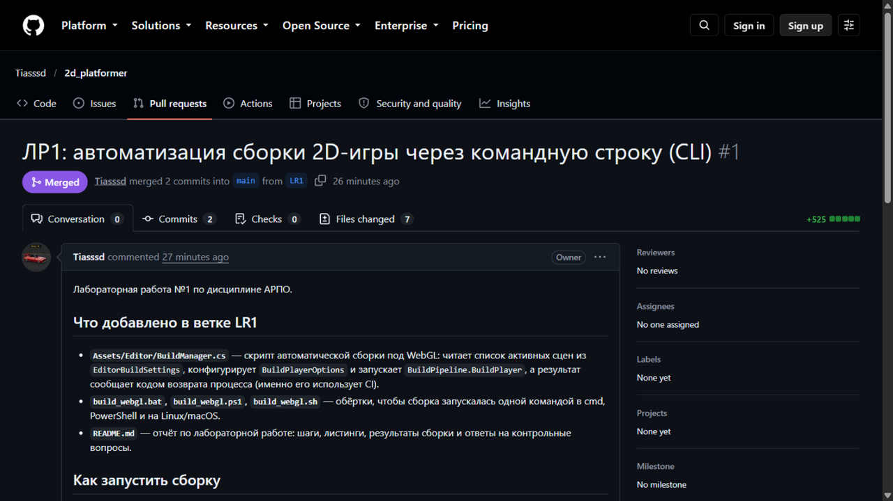


После получения двух аппрувов pull request объединён с веткой `main` кнопкой `Merge pull request`.


Ссылка на репозиторий размещена в лабораторной работе №1 в Google Classroom.

## Вывод

В ходе работы выполнена автоматическая сборка проекта Unity под платформу WebGL из командной строки, без открытия графического интерфейса редактора. Написан скрипт `BuildManager.cs`, который получает список активных сцен из настроек сборки, конфигурирует `BuildPlayerOptions` и запускает компиляцию через `BuildPipeline.BuildPlayer`, а результат сообщает кодом возврата процесса — именно этот код будет использовать система непрерывной интеграции. Освоены флаги командной строки `-batchmode`, `-nographics`, `-executeMethod`, `-quit` и `-logFile`. Собранная игра проверена локально через Live Server. Работа оформлена в Git по схеме ветвление → pull request → ревью → merge, что соответствует принятому в коммерческой разработке процессу.

## Контрольные вопросы

### 1. Зачем в команде запуска CLI использовать флаг `-nographics` и какую роль он сыграет при переносе пайплайна на удалённый сервер в облако?

Флаг `-nographics` отключает инициализацию графической подсистемы: Unity не создаёт окно, не обращается к видеокарте и не требует драйверов и дисплея. В паре с `-batchmode`, который отключает интерфейс редактора и диалоговые окна, он превращает редактор в обычную консольную утилиту.

На удалённом сервере сборки графической подсистемы обычно нет вообще: серверные Linux-машины и контейнеры в CI работают без X-сервера, видеокарта отсутствует. Без флага `-nographics` Unity попыталась бы инициализировать графику и завершилась бы с ошибкой ещё до начала сборки. Кроме того, отказ от графики снижает потребление ресурсов и делает процесс воспроизводимым и независимым от окружения. Для сборки WebGL рендеринг на машине сборщика не нужен: компилируется код и упаковываются ассеты.

### 2. Что произойдёт, если запустить консольную сборку проекта, в настройках Build Settings которого не выбрана ни одна сцена игры? Какая строка кода обрабатывает эту ситуацию?

Метод `GetScenes()` пройдёт по массиву `EditorBuildSettings.scenes`, не найдёт ни одной сцены с `enabled == true` и вернёт массив нулевой длины. Далее срабатывает проверка

```
if (levels.Length == 0)
{
    Debug.LogError("[CI/CD] Ошибка: В Настройках Сборки (Build Settings) не найдено ни одной активной сцены!");
    ExitWithCode(1);
    return;
}
```

в методе `BuildWebGL()`. В лог пишется сообщение об ошибке, метод `ExitWithCode(1)` завершает процесс Unity с кодом возврата `1`, и сборка не запускается. Ненулевой код возврата увидит система CI и пометит задачу сборки как упавшую, а не как успешно собранную пустую игру.

### 3. Почему класс `BuildManager` и его методы обязательно должны быть объявлены как `public static`?

`static` обязателен, потому что Unity запускает метод по имени, указанному в аргументе `-executeMethod`, через рефлексию: экземпляр класса не создаётся, поэтому вызвать нестатический (экземплярный) метод невозможно. По той же причине класс объявлен `static` — он служит только контейнером методов и не предназначен для создания объектов.

`public` обязателен, потому что обращение к типу и методу происходит извне: Unity ищет тип по строке `BuildManager` и вызывает метод `BuildWebGL` из другого контекста. К члену с модификатором `private` или `internal` внешний вызов получить не сможет, и сборка завершится ошибкой поиска метода.

## Приложение. Список скриншотов для отчёта

Все файлы сохраняются в папку `screenshots/` в корне проекта (имена совпадают со ссылками в тексте отчёта).

| Файл | Что должно быть на скриншоте |
|---|---|
| `01_unity_hub_template.png` | Unity Hub, создание проекта по шаблону 2D Platformer Microgame |
| `02_project_scene.png` | Unity: папка `Assets/Scenes` и открытая сцена игры |
| `03_build_settings_scene_list.png` | `File → Build Profiles`, основная сцена в списке сцен, галочка включена |
| `04_editor_folder_script.png` | папка `Assets/Editor` с `BuildManager.cs` и открытый код скрипта |
| `05_webgl_compression_disabled.png` | Project Settings → Player → Publishing Settings, `Compression Format = Disabled` |
| `06_menu_cicd.png` | верхнее меню Unity с пунктом `CI/CD → Build WebGL` |
| `07_cli_build_terminal.png` | терминал с командой сборки (`build_webgl.bat` или Unity.exe) |
| `08_build_log_success.png` | конец файла `build_webgl.log` со строкой `[CI/CD] УСПЕХ!` |
| `09_builds_webgl_folder.png` | папка `Builds/WebGL` с `index.html`, `Build`, `TemplateData` |
| `10_game_in_browser.png` | игра в браузере через Live Server, главный экран |
| `11_git_commands.png` | терминал: git-команды, коммиты и вывод `git push` |
| `12_pull_request.png` | страница PR `LR1 → main`, список ревьюеров |
| `13_files_changed_review.png` | вкладка `Files changed` с комментариями ревьюеров |
| `14_merged.png` | два аппрува и результат `Merge pull request` |
